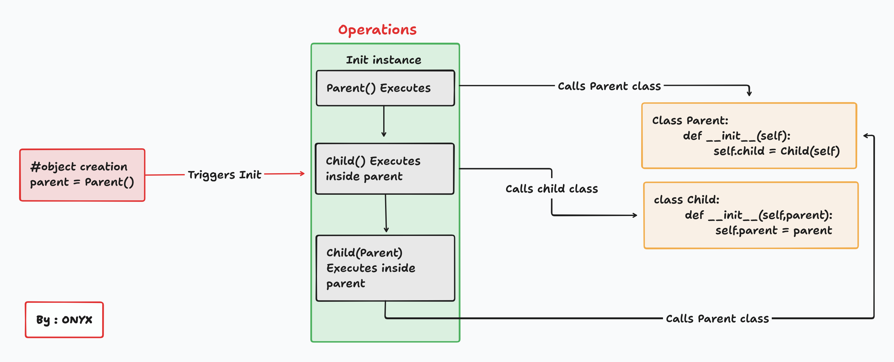

# 🧠 Garbage Collection & Memory Management in Python  
## A Practical Demo with Circular References

This project demonstrates how **Python manages memory**, especially when dealing with **circular references** — a common cause of memory leaks. It also shows how the **garbage collector** helps clean up such situations.


## 🔍 What Is Garbage Collection?

In Python, **memory management is automatic** — you don’t need to manually allocate or free memory like in C/C++. Python uses two main mechanisms:

1. **Reference Counting**
2. **Garbage Collector (GC)**

### 1. Reference Counting
Every object has a **reference count** — the number of variables or structures that refer to it. When this count reaches zero, the object is deleted.

```python
a = [1, 2, 3]   # reference count = 1
b = a           # reference count = 2
a = None        # reference count = 1
b = None        # reference count = 0 → list is deleted
```

### 2. Garbage Collector
Sometimes, objects refer to each other in a **cycle**, like this:

```
ParentObject → ChildObject → ParentObject
```

In such cases, reference counts never reach zero — causing a **memory leak**. That’s where the garbage collector comes in.

The `gc` module detects and cleans up these **circular references**.


## 📦 Code Overview

We define two classes that create a circular reference:

- `ParentObject` creates an instance of `ChildObject`, passing itself (`self`) to it.
- `ChildObject` stores a reference back to the `ParentObject`.

```python
class ParentObject:
    def __init__(self):
        self.child = ChildObject(self)  # Passes self to ChildObject

class ChildObject:
    def __init__(self, parent):
        self.parent = parent  # Stores reference to ParentObject
```
### 🖼️  Flow chart: Object Relationships
</img>


## 🔄 Step-by-Step Execution Flow

Here's what happens when we run the script:

### 1. Create Objects
```python
parent_instance = ParentObject()
```

- A `ParentObject` is created at address `A`.
- It creates a `ChildObject` at address `B`.
- The `ChildObject` stores a reference to the `ParentObject`.

```
[ ParentObject at A ] ↔ child → [ ChildObject at B ]
                          ↑            ↑
                          └── parent ──┘
```

### 2. Save IDs for Inspection
We save the memory addresses of both objects using `id()`.

```python
parent_id = id(parent_instance)
child_id = id(parent_instance.child)
```

### 3. Remove External Reference
We set `parent_instance = None` — removing the external reference.

- But the internal references (`parent.child` and `child.parent`) still exist.
- So the **reference count does not drop to zero**.

### 4. Run Garbage Collector
Finally, we call:

```python
collected = gc.collect()
```

- The garbage collector detects the circular reference.
- It safely deletes both objects.
- Memory is reclaimed.


## 📊 Visual: Reference Count Lifecycle

Let’s assume:

- Initial ref count of `ParentObject`: 2 (`parent_instance` and `child.parent`)
- Initial ref count of `ChildObject`: 1 (`parent.child`)

| Stage | Parent Ref Count | Child Ref Count |
|-------|------------------|-----------------|
| After creation | 2 | 1 |
| After `parent_instance = None` | 1 | 1 |
| After GC runs | 0 | 0 |


## 🧹 Why Garbage Collection Is Needed

Without garbage collection, the following would happen:

- Even though no one outside refers to the `ParentObject`, it can't be deleted because:
  - `ParentObject` holds a reference to `ChildObject`
  - `ChildObject` holds a reference to `ParentObject`

This forms a **cycle** that reference counting alone cannot resolve.

The garbage collector breaks these cycles so memory is properly freed.


## 🧪 Key Concepts Demonstrated

| Concept | Description |
|--------|-------------|
| **Reference Counting** | Python’s primary method of memory management |
| **Circular References** | When objects refer to each other directly or indirectly |
| **Memory Leak Risk** | Without GC, circular references may prevent memory from being freed |
| **Garbage Collector (`gc`)** | Detects and cleans up circular references |
| **Manual GC Invocation** | `gc.collect()` forces the garbage collector to run |
| **Low-Level Memory Access** | `ctypes.c_long.from_address(address).value` lets us inspect reference counts |


## 🖼️ ASCII MAP Diagram: Object Relationships

```
+----------------------+         +----------------------+
| ParentObject (A)     |         | ChildObject (B)      |
| ref_count = 2        |←--------| ref_count = 1        |
| child → B            |         | parent → A           |
+----------------------+         +----------------------+

After parent_instance = None:

+----------------------+         +----------------------+
| ParentObject (A)     |         | ChildObject (B)      |
| ref_count = 1        |←--------| ref_count = 1        |
| child → B            |         | parent → A           |
+----------------------+         +----------------------+

After gc.collect():

+----------------------+         +----------------------+
| Freed                |         | Freed                |
+----------------------+         +----------------------+
```
## ✅ Conclusion

This demo illustrates the importance of proper memory management in Python:

- Python handles most memory automatically via **reference counting**.
- However, **circular references** can lead to memory leaks.
- The **garbage collector** is essential for detecting and cleaning up such cases.
- Understanding how this works helps you write more efficient and robust applications.